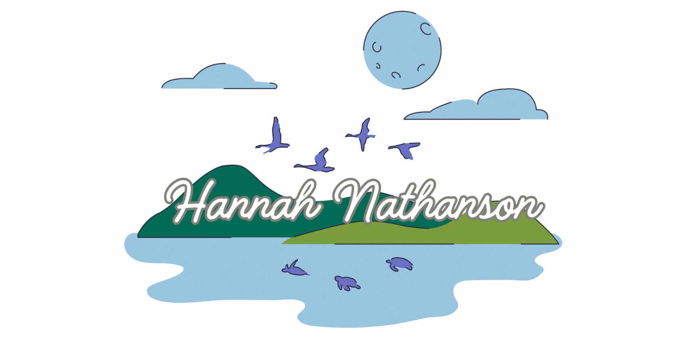

<!-- Typing animation -->

  

---

## About

Master’s student in Green Data Science with a first-class degree in Zoology, combining technical skills in data science with domain expertise in climate, biodiversity, and land-use systems. Experienced working across the full data lifecycle, from data collection and pipeline design to modelling and visualization alongside communication and presentation skills.

## Teach Stack

  <!-- Row 1 -->
  
  &nbsp;&nbsp;&nbsp;
  
  &nbsp;&nbsp;&nbsp;
  
  &nbsp;&nbsp;&nbsp;
  
  &nbsp;&nbsp;&nbsp;
  

  <!-- Row 2 -->
  
  &nbsp;&nbsp;&nbsp;
  
  &nbsp;&nbsp;&nbsp;
  
  &nbsp;&nbsp;&nbsp;
  

  <!-- Row 3 -->
  
  &nbsp;&nbsp;&nbsp;
  

  <!-- Row 4 -->
  
  &nbsp;&nbsp;&nbsp;
  

  <!-- Row 5 -->
  

## Education

<strong>MSc Green Data Science</strong> &nbsp;·&nbsp; University of Lisbon (ISA) &nbsp;·&nbsp; <em>in progress</em> 
Applied ML · Python · Data Management · UAV & LiDAR · Fire Behaviour · Natural Resource Economics

<strong>PGCE Secondary Science</strong> &nbsp;·&nbsp; University of Exeter &nbsp;·&nbsp; <em>Outstanding</em> 
Science Pedagogy · Communication · Metacognition · Leadership

<strong>BSc Zoology</strong> &nbsp;·&nbsp; University of Reading &nbsp;·&nbsp; <em>First Class Honours</em> 
Ecology · Bioinformatics · Statistics · Phylogenetic Modelling

## Research Experience

> *My data science work is grounded in real-world environmental contexts*

| Year | Topic | Location | Relevance |
|------|------|----------|-----------|
| 2018 | Phenotypic plasticity | Spain 🇪🇸 | Amphibian dataset collation & morphometric data analysis |
| 2017 | Carbon Value Assessment | Indonesia 🇮🇩 | REDD+ carbon accounting via 50m² rainforest habitat plots |
| 2016 | Phylogynetic Modeling | Indonesia 🇮🇩 | Computational modeling of evolutionary relationships with Bayestraits |
| 2015 | Biodiversity | Mexico 🇲🇽 | Multi-method biodiversity data collection |

## Recent Projects

- **UAV** — Geospatial modeling for forest health assessments
- **Big Data** - HPC Land-use model development with Sentinel-2 Data
- **Python** - Desktop GUI app, interactive library game
- **SQL** - Scalable relational database and automated data pipeline for cross-country crop breeding analysis
- **R** - 3D forestry modeling from Lidar data

## Awards

<h2 align="center">Contact</h2>

  Open to opportunities, collaborations, or just a chat

  
  &nbsp;&nbsp;&nbsp;
  
  &nbsp;&nbsp;&nbsp;
  

